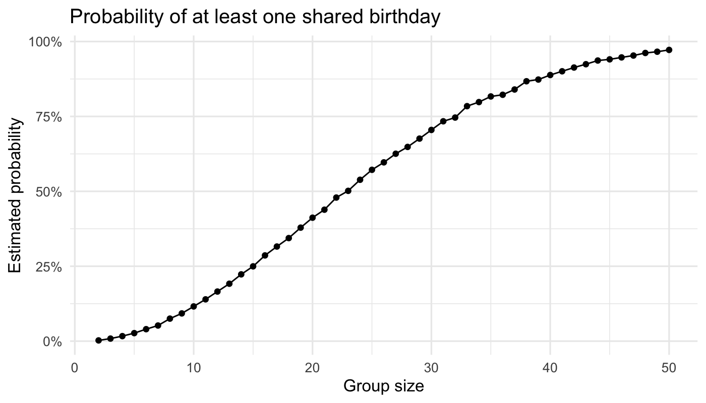
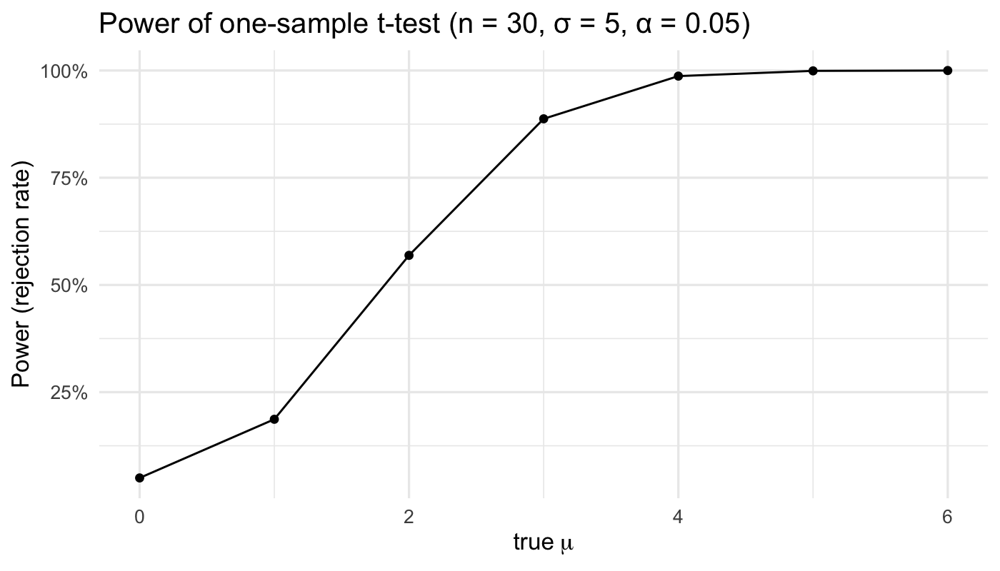
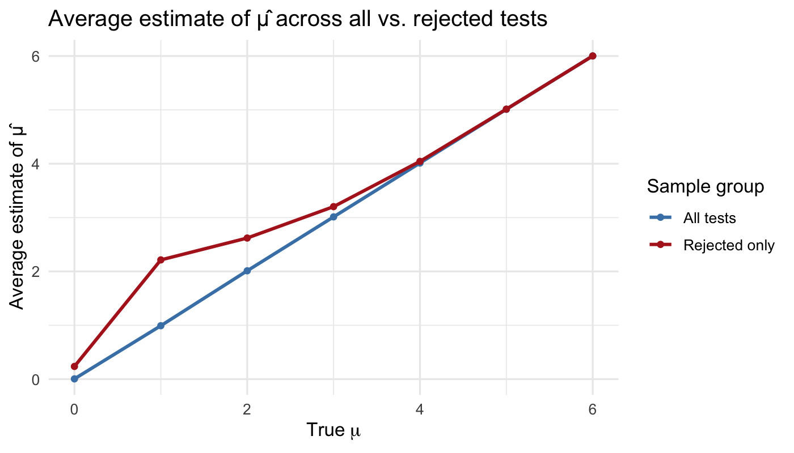
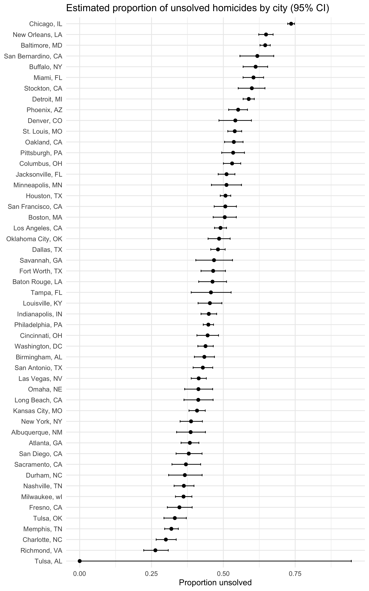

p8105_hw5_xm2356
================
Xinyin Miao (xm2356)
2025-11-11

# Problem 1

``` r
# write function
bday_sim = function(n_room){
  birthdays = sample(1:365, n_room, replace = TRUE)
  
  repeated_bday = length(unique(birthdays)) < n_room
  
  repeated_bday
}

# the probability of at least one shared birthday
bday_sim_results = 
  expand_grid(
    bdays = 2:50,        
    iter = 1:10000        
  ) |> 
  mutate(
    result = map_lgl(bdays, bday_sim)   
  ) |> 
  group_by(
    bdays
  ) |> 
  summarize(
    prob_repeat = mean(result)
  )

bday_sim_results
```

    ## # A tibble: 49 × 2
    ##    bdays prob_repeat
    ##    <int>       <dbl>
    ##  1     2      0.0024
    ##  2     3      0.0085
    ##  3     4      0.0167
    ##  4     5      0.0267
    ##  5     6      0.0399
    ##  6     7      0.0521
    ##  7     8      0.0751
    ##  8     9      0.0925
    ##  9    10      0.116 
    ## 10    11      0.139 
    ## # ℹ 39 more rows

``` r
# plot
bday_sim_results |> 
  ggplot(aes(x = bdays, y = prob_repeat)) +
  geom_point() +
  geom_line() +
  scale_y_continuous(labels = scales::percent_format(accuracy = 1)) +
  labs(
    title = "Probability of at least one shared birthday",
    x = "Group size",
    y = "Estimated probability"
  ) +
  theme_minimal(base_size = 12)
```



The simulated results show a sharply increasing relationship between
group size and the probability that at least two people share a
birthday. When the group size is small (fewer than 10 people), the
probability of a shared birthday is close to zero. As the number of
people increases, this probability rises rapidly, reaching approximately
50% when there are about 23 individuals in the room. Beyond 40 people,
the probability exceeds 90%, and by 50 it approaches certainty. These
results highlight that: even with only a few dozen people, coincidences
such as shared birthdays become surprisingly likely. The smooth S-shaped
curve confirms the robustness of the simulation and aligns closely with
theoretical expectations.

# Problem 2

``` r
n <- 30
sigma <- 5
alpha <- 0.05
mus <- 0:6
n_sims <- 5000

sim_one_mu <- function(mu, n_sims, n, sigma, alpha = 0.05) {
  tibble(sim = 1:n_sims) |>
    mutate(
      x = map(sim, ~ rnorm(n, mean = mu, sd = sigma)),
      t_out = map(x, ~ t.test(.x, mu = 0, conf.level = 1 - alpha)),
      t_tidy = map(t_out, broom::tidy)
    ) |>
    select(-x, -t_out) |>
    unnest(t_tidy) |>
    transmute(mu = mu, estimate = estimate, p_value = p.value)
}
```

``` r
p2_sims <- map_dfr(mus, ~ sim_one_mu(.x, n_sims, n, sigma, alpha))
```

## Power curve: proportion of rejections vs mu

``` r
p2_power <- p2_sims |>
  group_by(mu) |>
  summarise(power = mean(p_value < alpha), .groups = "drop")

p_power <- p2_power |>
  ggplot(aes(mu, power)) +
  geom_line() +
  geom_point(size = 1.5) +
  scale_y_continuous(labels = scales::percent_format(accuracy = 1)) +
  labs(
    title = "Power of one-sample t-test (n = 30, σ = 5, α = 0.05)",
    x = expression(true~mu),
    y = "Power (rejection rate)"
  ) +
  theme_minimal(base_size = 12)

p_power
```



The plot shows that statistical power increases rapidly as the true mean
(μ) moves further away from zero. When μ = 0, the probability of
rejecting the null hypothesis is approximately 5%, as expected for a
test with α = 0.05. As the effect size grows, the power rises sharply:
around μ = 2, the test detects a true effect more than half of the time,
and by μ ≥ 4, power approaches 100%. This strong positive association
indicates that larger deviations from the null hypothesis make it easier
for the t-test to identify true effects.

## Average estimate vs mu

``` r
p2_est <- p2_sims |>
  group_by(mu) |>
  summarise(
    avg_est_all = mean(estimate),
    avg_est_reject = mean(estimate[p_value < alpha]),
    .groups = "drop"
  )

p_est_combined <- p2_est |>
  ggplot(aes(x = mu)) +
  # line for all tests
  geom_line(aes(y = avg_est_all, color = "All tests"), linewidth = 1) +
  geom_point(aes(y = avg_est_all, color = "All tests"), size = 1.5) +
  # line for rejected tests
  geom_line(aes(y = avg_est_reject, color = "Rejected only"), linewidth = 1) +
  geom_point(aes(y = avg_est_reject, color = "Rejected only"), size = 1.5) +
  # custom color legend
  scale_color_manual(
    values = c("All tests" = "steelblue", "Rejected only" = "firebrick")
  ) +
  labs(
    title = "Average estimate of μ̂ across all vs. rejected tests",
    x = expression(True~mu),
    y = "Average estimate of μ̂",
    color = "Sample group"
  ) +
  theme_minimal(base_size = 12) 

p_est_combined
```



The sample average of 𝜇̂ across tests for which the null hypothesis was
rejected is not approximately equal to the true value of 𝜇, especially
when the true effect size is small. In the combined plot, the red line
(“Rejected only”) is generally above the blue line (“All tests”) for
small μ, though they overlap when the effect is large. This pattern
shows that significant results tend to overestimate the true mean
because only samples with unusually large random deviations achieve p \<
0.05 when μ is near zero. As μ increases, this bias diminishes and the
two lines converge. The blue line remains close to the true μ
throughout, confirming that the one-sample t-test is unbiased overall
without selection on significance.

# Problem 3

``` r
homicides_raw = readr::read_csv("data/homicide-data.csv") |> 
    janitor::clean_names()
```

The `homicides_raw` dataset has 52179 observations of criminal homicides
reported in 50 large U.S. cities. Each row represents one homicide case.
The dataset includes 12 variables describing the victim’s demographics
(last name, first name, age, sex, race), the location of the homicide
(city, state, latitude, longitude), the case outcome (disposition) and
the case reported date. The disposition variable indicates whether the
case was “Closed by arrest,” “Closed without arrest,” or remains
“Open/No arrest.”

``` r
homicides = homicides_raw |>
  mutate(
    city_state = str_c(city, ", ", state),
    unsolved = disposition %in% c("Open/No arrest", "Closed without arrest")
  )
homicides |> 
  slice_head(n = 6)
```

    ## # A tibble: 6 × 14
    ##   uid   reported_date victim_last victim_first victim_race victim_age victim_sex
    ##   <chr>         <dbl> <chr>       <chr>        <chr>       <chr>      <chr>     
    ## 1 Alb-…      20100504 GARCIA      JUAN         Hispanic    78         Male      
    ## 2 Alb-…      20100216 MONTOYA     CAMERON      Hispanic    17         Male      
    ## 3 Alb-…      20100601 SATTERFIELD VIVIANA      White       15         Female    
    ## 4 Alb-…      20100101 MENDIOLA    CARLOS       Hispanic    32         Male      
    ## 5 Alb-…      20100102 MULA        VIVIAN       White       72         Female    
    ## 6 Alb-…      20100126 BOOK        GERALDINE    White       91         Female    
    ## # ℹ 7 more variables: city <chr>, state <chr>, lat <dbl>, lon <dbl>,
    ## #   disposition <chr>, city_state <chr>, unsolved <lgl>

## Summarize totals and unsolved per city

``` r
city_totals <- homicides |>
  group_by(city_state) |>
  summarise(
    total = n(),
    unsolved = sum(unsolved, na.rm = TRUE),
    .groups = "drop"
  )

city_totals |> 
  arrange(desc(total)) |> 
  slice_head(n = 10)
```

    ## # A tibble: 10 × 3
    ##    city_state       total unsolved
    ##    <chr>            <int>    <int>
    ##  1 Chicago, IL       5535     4073
    ##  2 Philadelphia, PA  3037     1360
    ##  3 Houston, TX       2942     1493
    ##  4 Baltimore, MD     2827     1825
    ##  5 Detroit, MI       2519     1482
    ##  6 Los Angeles, CA   2257     1106
    ##  7 St. Louis, MO     1677      905
    ##  8 Dallas, TX        1567      754
    ##  9 Memphis, TN       1514      483
    ## 10 New Orleans, LA   1434      930

## Baltimore

``` r
baltimore_counts <- city_totals |> filter(city_state == "Baltimore, MD")

baltimore_tidy <- broom::tidy(prop.test(
  x = baltimore_counts$unsolved,
  n = baltimore_counts$total
)) |>
  mutate(city_state = "Baltimore, MD") |>
  select(city_state, estimate, conf.low, conf.high) 

baltimore_tidy
```

    ## # A tibble: 1 × 4
    ##   city_state    estimate conf.low conf.high
    ##   <chr>            <dbl>    <dbl>     <dbl>
    ## 1 Baltimore, MD    0.646    0.628     0.663

## All cities

``` r
city_props <- city_totals |>
  mutate(
    test_obj = map2(unsolved, total, ~ prop.test(.x, .y)),
    test_tidy = map(test_obj, broom::tidy)
  ) |>
  select(city_state, test_tidy) |>
  unnest(test_tidy) |>
  select(city_state, estimate, conf.low, conf.high) |> 
  arrange(desc(estimate)) 

city_props
```

    ## # A tibble: 51 × 4
    ##    city_state         estimate conf.low conf.high
    ##    <chr>                 <dbl>    <dbl>     <dbl>
    ##  1 Chicago, IL           0.736    0.724     0.747
    ##  2 New Orleans, LA       0.649    0.623     0.673
    ##  3 Baltimore, MD         0.646    0.628     0.663
    ##  4 San Bernardino, CA    0.618    0.558     0.675
    ##  5 Buffalo, NY           0.612    0.569     0.654
    ##  6 Miami, FL             0.605    0.569     0.640
    ##  7 Stockton, CA          0.599    0.552     0.645
    ##  8 Detroit, MI           0.588    0.569     0.608
    ##  9 Phoenix, AZ           0.551    0.518     0.584
    ## 10 Denver, CO            0.542    0.485     0.598
    ## # ℹ 41 more rows

## Plot

``` r
plot_city_ci <- city_props |>
  ggplot(aes(x = reorder(city_state, estimate), y = estimate)) +
  geom_errorbar(aes(ymin = conf.low, ymax = conf.high), width = 0.2) +
  geom_point(size = 2) +
  coord_flip() +
  labs(
    title = "Estimated proportion of unsolved homicides by city (95% CI)",
    x = NULL,
    y = "Proportion unsolved"
  ) +
  theme_minimal(base_size = 12)

plot_city_ci
```


